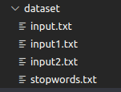
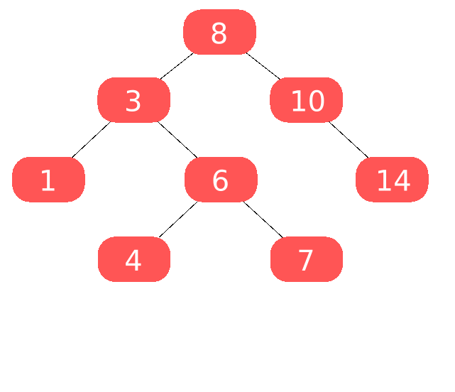
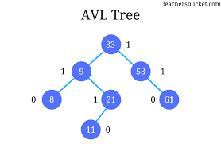
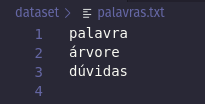
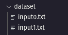

# SUGESTÕES DE PALAVRAS - UTILIZAÇÃO DE ÁRVORES
Trabalho da discipilna de Algoritmos e Estruturas de Dados 2.

##  PROPOSTA
O objetivo consiste em implementar um algoritmo base para criar um sistema de autocompletar e sugestões de palavras para os usuários. 

Para alcançar esse objetivo, utilizaremos a estrutura de árvores binárias que são implementadas e utilizadas neste algoritmo.

Esse trabalho da continuidade ao trabalho anterior da disciplina que implementava um algoritmos de [top k elements](https://github.com/em4nuelvt/top-k-items) para encontrar os k elementos mais frequentes em uma base de dados.

Como mencionado, este algoritmo ainda não implementa um sistema de autocompletar, mas implementa e exemplifica as estruturas de dados base para a implementação de um.

## ENTRADAS

A entrada consiste de uma sequência de arquivos de texto nomeados de "input.txt", um arquivo de stopwords nomeado "stopwords.txt", que apresenta as palavras que devem ser desconsideradas pelo algoritmo na implementação da solução, e um arquivo "palavras.txt", com uma lista de palavras que serão utilizadas como "entrada do usuário", ou seja, serão as palavras que devemos buscar as semelhanças nos textos de input para montar as árvores e apresentar ao usuário. 

Para cada palavra desse arquivo, uma heap será criada em relação a cada texto de `input.txt` e para cada heap 3 árvores serão construidas: binária, AVL e Huffman.

Os arquivos de texto do tipo `input.txt` devem seguir um padrão de nomenclatura. Para garantir que a leitura dos arquivos ocorram corretamente.

`Exemplo`: quantidade de entradas(fora stopwords) = 2 - arquivos de entrada serão: "input0.txt" e "input1.txt".

No repositório do projeto encontra-se os dois textos utilizados para testes:
["input0.txt"](dataset/input0.txt) e ["input1.txt"](dataset/input1.txt)



Além disso, é importante destacar que assim como no algoritmo do top k elementos, o valor de K é definido como uma constante no próprio código no arquivo de cabeçalho [`tratamento.hpp`](src/tratamento.hpp). Para a execução de testes e apreentação da saída o valor de K utilizado será 20.

# IMPLEMENTAÇÃO


## Visão Geral

A implementação pode ser descrita pelas seguintes etapas:

* Obter a lista de palavras que vão ser analisadas: leitura do arquivo `palavras.txt`, cada palavra é tratada e inserida em um `std::vector`de strings.
* Obter as stopwords: leitura do arquivo `stopwords.txt` que contem as palavras que não devem ser inseridas nas hashes.
* Obter as Hashes: leitura de cada texto, ou seja, cada arquivo `input.txt` e armazenar cada um deles em uma hash diferente. 

Após obter as entradas e montar a hash para cada texto as seguintes operações são realizadas:

* Para cada palavra, montar a heap em relação a cada texto e criar cada uma das 3 árvores para cada heap diferente. 

Uma esquematização para essa parte pode ser expressa como:

``````
Para cada palavra lida de palavras.txt:
    Para cada texto:
       Se palavra existir no texto:
            - Criar heap a partir da hash;
            - Criar as árvores (binária, AVL e Huffman) a partir da heap.
            - Imprimir as árvores no arquivo de saída
            
``````
Essa respresentação aponta um pseudo-código para o loop principal de operações do algoritmo.

Uma visão geral foi apresentada, mas, a seguir, consta uma explicação detalhada sobre cada estrutura utilizada, bem como sua análise assintótica.

## Leitura e Tratamento das Entradas

A função `run()` é chamada na função `main()` e é responsável por iniciar a execução do algoritmo.

Para ler os arquivos de entrada, foram implementadas as funções: 
 - `readWords()`: realiza a leitura das palavras que irão relacionar as árvores.
 - `readStopWords()`: realiza a leitura das stopwords. 
 - `obterHash()`: realiza a leitura dos textos e armazena as palavras e frequências de cada um em um `std::vector` de `std::unordered_map`.

Essas funções são chamadas na função `run()` e são utilizadas da seguinte forma:

```cpp
    //obter as palavras que irão ser trabalhadas
    vector<string> palavras;
    readWords(palavras);

    //obter as stopwords
    vector<string> stopwords;
    readStopWords(stopwords);
    
    //obter as hashes
    vector<unordered_map<string,int>> wordFrequence;
    obterHash(wordFrequence,stopwords);
``````


Todas essas funções de leitura utilizam a biblioteca `<fstream>` para manipulação dos arquivos.

 As palavras lidas são tratadas com as funções:

- `removePunctuation()`: remove as pontuações das strings lidas.
- `lowerString()`: converte os caracteres da palavra para minúsculo.

Alguns caracteres precisam de tratamentos específicos, mas a estratégia utilizada como solução é substituir sempre os caracteres indesejados por caracteres de espaço,como mostra a função a seguir:

``` cpp

string removePunctuation(string word) {
    
    string cleanedWord;
    size_t pos = 0;
     //substituir esses caracteres esquisitos
    while ((pos = word.find_first_of("”—", pos))!= std::string::npos) {
        word.replace(pos, 3, " "); // Substitui por espaço
        pos += 1; // Avança para evitar substituições em loop
    }
    for (size_t i = 0; i < word.length(); i++) {
        char c = word[i];
        if( ((c=='.'||c==','||c=='!'||c=='?'||c==':'||c==';')&& isalnum(word[i+1]))||
            (c=='-'&&i==(word.length()-1))){
            word[i]=' ';
        }
        c=word[i];
        if(word[i]=='-'&&word[i+1]=='-'){
            word[i]=' ';
            word[i+1]=' ';
        }
        c = word[i];
        if (!ispunct(c) || ((c == '-')) || c == '/' || c == '_') {
            cleanedWord += c;
        }
        
    }
    return cleanedWord;
}

```
## Hash `std::unordered_map` 

Após formatar as palavras, cada uma é inserida em um `unordered_map`.

O `unordered_map` é uma classe da biblioteca padrão do C++ que implementa uma tabela de hash associativa. Essa estrutura faz parte da família de contêineres do C++ e é utilizada para armazenar pares de chave-valor, onde cada chave é única e mapeada para um valor correspondente. No caso do problema, a chave é a própria palavra e o valor associado é a frequência em que a palavra ocorre no texto.

Para tratar colisões, o `unordered_map` usa técnicas como listas encadeadas para armazenar várias entradas que mapeiam para o mesmo índice.

O hash padrão usado em `std::unordered_map` em C++ é o objeto de função `std::hash<Key>`, onde `Key` é o tipo das chaves no mapa. Esse objeto de função tem especializações padrão para todos os tipos integrados, como int, char, bool, etc., e alguns outros tipos da biblioteca padrão, como std::string e std::thread. Para esses tipos, a função de hash retorna um valor size_t que representa o padrão de bits da chave. Por exemplo, para uma chave int, a função de hash simplesmente retorna a própria chave convertida para size_t.

Para outros tipos que não são integrados nem tipos da biblioteca padrão, como classes ou structs definidos pelo usuário, é necessário especializar `std::hash<Key>` para o seu tipo ou criar seu próprio objeto de função que implementa uma função de hash para esse tipo. Você pode então passar esse objeto de função como um parâmetro de template para `std::unordered_map`.

A chance de colisão, que significa que duas chaves diferentes têm o mesmo valor de hash, depende da implementação da função de hash e do tamanho da tabela de hash. Geralmente, uma boa função de hash deve distribuir uniformemente as chaves pela tabela de hash e evitar aglomerações ou padrões. 

A documentação da STL do C++ não especifica como as funções de hash são implementadas para diferentes tipos, então isso fica a cargo de cada fornecedor de compilador decidir (no caso, o gcc/g++).

Por exemplo, no gcc , a função de hash para `std::string` é definida da seguinte forma:

```cpp
template<>
struct hash<string>
  : public __hash_base<size_t, string>
{
  size_t
  operator()(const string& __s) const noexcept
  { return std::_Hash_impl::hash(__s.data(), __s.length()); }
};
```

Essa função chama uma função auxiliar `std::_Hash_impl::hash`, que é definida:

```cpp
struct _Hash_impl
{
  static size_t
  hash(const void* __ptr, size_t __clength,
       size_t __seed = static_cast<size_t>(0xc70f6907UL))
  {
    // Semelhante ao hash murmur
    const size_t __m = 0x5bd1e995;
    const int __r = 24;
    size_t __h = __seed ^ __clength;
    const unsigned char* __data = static_cast<const unsigned char*>(__ptr);
    for (; __clength >= sizeof(size_t); __data += sizeof(size_t), __clength -= sizeof(size_t))
      {
        size_t __k = *reinterpret_cast<const size_t*>(__data);
        __k *= __m;
        __k ^= __k >> __r;
        __k *= __m;
        __h *= __m;
        __h ^= __k;
      }
    switch (__clength)
      {
      case 3:
        __h ^= static_cast<size_t>(__data[2]) << 16;
      case 2:
        __h ^= static_cast<size_t>(__data[1]) << 8;
      case 1:
        __h ^= static_cast<size_t>(__data[0]);
        __h *= __m;
      };
    // Faz algumas misturas finais
    __h ^= __h >> 13;
    __h *= __m;
    __h ^= __h >> 15;
    return __h;
  }
};
```

Essa função implementa uma variante do MurmurHash2. Ela recebe um ponteiro para os dados, seu comprimento e um valor de semente opcional como parâmetros, e retorna um valor size_t como código de hash. 

A seguir uma representação de uma tabela hash em que as chaves(no caso nomes) são direcionadas para um endereço do vetor pela função de hash:


<p style="text-align: justify">Vale ressaltar que uma estrutura de hash é uma ótima escolha para contagem de palavras por ter um custo de acesso constante O(1). Utilizar uma estrutura como um vetor convencional afetaria significativamente o custo do algoritmo por ser necessário percorrer todo o vetor para fazer buscas e ajustes nos dados armazenados.<p\>

## Trabalhando com cada palavra
A função `workWithEachWord()` também é chamada na função `run()`. 

Essa função apresenta o loop principal de operações do algoritmo. Nela, a heap e as árvores correspondesntes para cada palavra são criadas e  os resultados no arquivo de saída são impressos.

O trecho de código abaixo mostra como:

```cpp

void workWithEachWord(vector<unordered_map<string,int>> &wordFrequence,vector<string> &palavras ){
    //para cada palavra, fazendo a análise da palavra para cada texto: heap, arvóre binária e huffman.

    //abrir arquivo de escrita
    ofstream print;
    print.open("dataset/output.txt");
    if(!print.is_open()){
        print<<"falha na abertura do arquivo de escrita"<<endl;
        return;
    }
    for(int i=0;i<palavras.size();i++){
        print<<"PALAVRA "<<i<<": "<<palavras[i]<<endl;
        for(int j=0;j<wordFrequence.size();j++){
            print<<endl<<"Texto "<<j<<"("<<palavras[i]<<")"<<endl;
            if(wordFrequence[j][palavras[i]]==0){
                print<<"Palavra: " <<palavras[i]<<" não está presente no texto "<<j<<endl;
            }else{
                //garantindo que e palavra analisada nao vai aparecer entre as k mais frequentes
                int tmp = wordFrequence[j][palavras[i]];
                wordFrequence[j][palavras[i]]=0;
                
                //criando heap para essa palavra, analisando nesse texto
                Heap* heap = createHeap(K);
                for (const auto& entry : wordFrequence[j]) {
                    insert(heap, entry.first.c_str(), entry.second);
                }

                //criando a árvore binária
                treeNode* raizBT=NULL;
                for(int i=1;i<=K;i++){
                    raizBT=inserir(raizBT,heap->heap[i].word,heap->heap[i].frequency); //inserindo cada elemento
                }
                //imprimindo a árvore binária
                print<<endl<<"ÁRVORE BINÁRIA(inorder): "<<endl;
                imprimir(raizBT,print);

                //criando a árvore AVL
                No* raizAVL=NULL;
                for(int i=1;i<=K;i++){
                    raizAVL=inserirAVL(raizAVL,heap->heap[i].word,heap->heap[i].frequency); //inserindo cada elemento
                }
                //imprimindo a árvore AVL
                print<<endl<<"ÁRVORE AVL(inorder): "<<endl;
                imprimeEmOrdem(raizAVL,print);
                
                // Criar a árvore de Huffman
                HuffmanNode* huffmanTree = buildHuffmanTree(heap);

                // Imprimir a árvore de Huffman
                print << endl << "ÁRVORE DE HUFFMAN:" << endl;
                printHuffmanTree(huffmanTree, print);

                // Destruir a árvore de Huffman após o uso
                destroyHuffmanTree(huffmanTree);

                //volta o valor da palavra na hash
                wordFrequence[j][palavras[i]]=tmp;
            }
        }
        print<<"---------------------------------------------------------------------------------";
        print<<endl<<endl;
    }

}
```

## Estrutura Heap

<p style="text-align: justify">
Para organizar e obter as palavras mais frequentes armazenadas na estrutura hash, utiliza-se a estrutura de heap mínimo. Em um heap mínimo, o nó raiz sempre conterá o valor mínimo entre todos os elementos no heap. Os nós pais terão valores menores que os valores em seus nós filhos. Essa propriedade possibilita a recuperação eficiente do valor mínimo e seguir uma estrutura "crescente" de valores, do nó raiz aos seus filhos abaixo na estrutura de árvore. Dessa forma, nas folhas da estrutura, estão os elementos mais frequentes. A imagem a seguir exemplifica a configuração de um heap mínimo:
<p\>


<p style="text-align: justify">
O algoritmo implementado segue a seguinte estrutura e funções:<p\>

```cpp
typedef struct {
    char* word;
    int frequency;
} WordFrequency;

```

```cpp
typedef struct {
    WordFrequency* heap;
    int size;
    int capacity;
} Heap;

```


- `createHeap()`: aloca memória e inicializa a estrutura do heap, com capacidade máxima.
- `insert()`: insere um novo elemento no heap e verifica se deve substituir o elemento na raiz caso tenha maior prioridade e realiza o reequilíbrio da árvore com `adjustHeap()`.
- `adjustHeap()`: mantém a propriedade de min heap ao percorrer a árvore e trocar elementos fora de ordem. Chamado após inserções e remoções.
- `shouldInsert()`: verifica se o elemento a ser inserido tem maior prioridade que o da raiz, para possível substituição.

A heap é criada e utilizada dentro de um laço dentro da função `workWithEachWord()`, como mostra o trecho abaixo:

```cpp
for(int i=0;i<palavras.size();i++){
    print<<"PALAVRA "<<i<<": "<<palavras[i]<<endl;
    for(int j=0;j<wordFrequence.size();j++){
        print<<endl<<"Texto "<<j<<"("<<palavras[i]<<")"<<endl;
        if(wordFrequence[j][palavras[i]]==0){
            print<<"Palavra: " <<palavras[i]<<" não está presente no texto "<<j<<endl;
        }else{
            //garantindo que e palavra analisada nao vai aparecer entre as k mais frequentes
            int tmp = wordFrequence[j][palavras[i]];
            wordFrequence[j][palavras[i]]=0;
            
            //criando heap para essa palavra, analisando nesse texto
            Heap* heap = createHeap(K);
            for (const auto& entry : wordFrequence[j]) {
                insert(heap, entry.first.c_str(), entry.second);
            }
        }
    }
}        
```

## Árvores
As árvores utilizadas nesse trabalho foram construídas a partir do resultado obtido pela heap na iteração corrente do loop principal, ou seja em relação à análise de uma palavra do vetor `palavras` em comparação a um dos textos.
Vale ressaltar que as árvores utilizadas foram:
`Árvore Binária de Busca`, `Árvore AVL` e `Árvore de Huffman`.
As propriedades de cada uma delas e seu comportamento assintótico são especificados a seguir.

## Árvore Binária

Uma **árvore binária** é uma estrutura de dados  que consiste em um conjunto de nós, onde cada nó pode ter no máximo dois filhos: um à esquerda e outro à direita. Essa estrutura é frequentemente usada para organizar dados de forma hierárquica, facilitando operações como busca, inserção e remoção de elementos por classificar os dados de acordo com o seu valor.
Dados são inseridos e buscados sempre seguindo a regra de que elementos maiores estão à direita e menores à esquerda, seguindo o caminhamento nos nós filhos , como mostra o gif:



### Funções Implementadas

* `treeNode* inserir(treeNode* raiz, string palavra, int frequencia)`
Esta função permite a inserção de um novo nó em uma árvore binária. Ela recebe como argumento a raiz da árvore, uma palavra e sua frequência. O novo nó é inserido na posição apropriada da árvore de acordo com a frequência da palavra, seguindo as propriedades de uma árvore binária de busca (nós menores à esquerda e nós maiores à direita).

* `void imprimir(treeNode* raiz, std::ofstream &print)`
Esta função realiza um percurso na árvore binária, chamado de **in-order traversal**, que imprime os nós em ordem crescente com base nas frequências. Para cada nó, imprime a palavra e sua frequência.

### Custo Computacional

- A função `inserir()` tem um custo computacional médio de O(log n), onde n é o número de nós na árvore. No pior caso, quando a árvore não está balanceada, o custo pode ser O(n), o que ocorre quando a árvore se torna uma lista encadeada.

- A função `imprimir()` percorre todos os nós da árvore uma vez, resultando em um custo computacional de O(n), onde n é o número de nós na árvore.

É importante notar que o desempenho das operações em uma árvore binária pode variar dependendo da estrutura da árvore, talvez uma árvore binária desbalanceada não possua um desempenho tão interessante 

## Árvore AVL

Uma **árvore AVL** é uma variação da árvore binária de busca que mantém o balanceamento automático da árvore, garantindo que a diferença de altura entre as subárvores esquerda e direita de qualquer nó (fator de balanceamento) seja no máximo 1. Isso resulta em um desempenho de busca eficiente, independentemente da ordem de inserção dos elementos.

A imagem abaixo mostra um exemplo de árvore AVL e mostra a diferença de altura máxima em 1:




### Funções Implementadas

* `No* novoNo(string palavra, int frequencia)`
Esta função cria e retorna um novo nó com uma palavra e sua frequência. O nó é inicializado com ponteiros para os filhos esquerdo e direito como nulo (vazio) e altura inicializada como 0.

* `short maior(short a, short b)`
Uma função auxiliar que retorna o maior valor entre dois valores inteiros curtos.

* `short alturaDoNo(No *no)`
Calcula e retorna a altura de um nó ou -1 se o nó for nulo.

* `short fatorDeBalanceamento(No *no)`

Calcula e retorna o fator de balanceamento de um nó, que é a diferença entre a altura da subárvore esquerda e a altura da subárvore direita.

#### Rotações

* `No* rotacaoEsquerda(No *r)`: Realiza uma rotação à esquerda no nó 'r'.

* `No* rotacaoDireita(No *r)`: Realiza uma rotação à direita no nó 'r'.

* `No* rotacaoEsquerdaDireita(No *r)`: Realiza uma rotação à esquerda seguida de uma rotação à direita no nó 'r'.

* `No* rotacaoDireitaEsquerda(No *r)`: Realiza uma rotação à direita seguida de uma rotação à esquerda no nó 'r'.

Essas rotações são usadas para manter o balanceamento da árvore AVL após uma inserção ou remoção.

* `No* balancear(No *raiz)`
Esta função realiza o balanceamento da árvore após uma inserção ou remoção, garantindo que ela continue sendo uma árvore AVL.

* `No* inserirAVL(No *raiz, string palavra, int frequencia)`
Inserção de um novo nó na árvore AVL. A função decide se a inserção será à esquerda ou à direita com base na frequência e, se necessário, realiza o balanceamento da árvore.

*`void imprimeEmOrdem(No* raiz, std::ofstream &print)`
Esta função realiza um percurso in-order na árvore AVL, imprimindo os nós em ordem crescente com base nas frequências. Para cada nó, imprime a palavra e sua frequência.

### Custo Computacional

- A função `inserirAVL()` tem um custo computacional médio de O(log n), onde 'n' é o número de nós na árvore AVL. Graças ao balanceamento automático, o desempenho de busca é garantido como logarítmico.

- A função `imprimeEmOrdem()` percorre todos os nós da árvore uma vez, resultando em um custo computacional de O(n), onde 'n' é o número de nós na árvore.

A principal vantagem da árvore AVL em relação a uma árvore binária de busca simples é que ela mantém o balanceamento automaticamente, garantindo desempenho consistente e previsível em operações de busca, inserção e remoção, independentemente da ordem de inserção dos elementos.

## Árvore de Huffman

A **árvore de Huffman** é uma estrutura de dados usada para compressão de dados, onde os caracteres mais frequentes recebem códigos binários mais curtos e os menos frequentes recebem códigos mais longos. Ou seja, é  usada para compressão de dados com base nas frequências das palavras.
Abaixo estão as funções que foram implementadas para manipular a árvore de Huffman:

### Funções Implementadas

* `bool compareNodes(HuffmanNode* a, HuffmanNode* b)`
Esta função é usada para comparar os nós da árvore de Huffman com base em suas frequências. É essencial para manter um min-heap durante a construção da árvore de Huffman. Os nós com menor frequência devem ter prioridade.

* `HuffmanNode* buildHuffmanTree(Heap* heap)`
Esta função constrói a árvore de Huffman a partir de um min-heap de nós iniciais, representando cada palavra e sua frequência. Ela combina os nós do min-heap até que reste apenas um nó raiz, que é a árvore de Huffman completa.

* `void printHuffmanTree(HuffmanNode* root, std::ofstream& print)`
Esta função imprime a árvore de Huffman em ordem. Para cada nó, verifica se ele é uma folha (representando uma palavra) e, se for o caso, imprime a palavra e sua frequência.

* `void destroyHuffmanTree(HuffmanNode* root)`
Esta função é usada para liberar a memória alocada para a árvore de Huffman. Ela percorre a árvore em pós-ordem, liberando os nós e as palavras.

### Custo Computacional

- A função `buildHuffmanTree()` tem um custo computacional de O(n * log n), onde 'n' é o número de elementos no heap inicial. Isso ocorre porque as operações de inserção e remoção no min-heap têm um custo logarítmico.

- A função `printHuffmanTree()` percorre todos os nós da árvore uma vez, resultando em um custo computacional de O(n), onde 'n' é o número de nós na árvore.

- A função `destroyHuffmanTree()` também percorre todos os nós da árvore uma vez, resultando em um custo computacional de O(n), onde 'n' é o número de nós na árvore.


# SAÍDA E ANÁLISE DE RESULTADO

A saída consiste em um arquivo `output.txt` que é gerado após a execução do algoritmo.
Esse arquivo apresenta cada uma das 3 árvores relativas a cada palavra em relação a cada texto de input. 
O tamanho desse arquivo vai depender do tamanho da entrada.

## Exemplo 
A lista de palavras que vão ser analisadas no algoritmo estão no arquivo [palavras.txt](dataset/palavras.txt) como mostra 



E os textos dos analisados serão os textos de dos arquivos de `input`:



A saída para a palavra `palavra` analisando somente o texto 0 foi:

```
PALAVRA 0: palavra

Texto 0(palavra)

ÁRVORE BINÁRIA(inorder): 
às: 95
vista: 96
mas: 96
imanente: 104
sentido: 110
segundo: 114
sobre: 114
sistema: 115
pensamento: 115
priori: 125
entre: 127
modo: 129
mais: 133
mundo: 134
condição: 134
sujeito: 145
teoria: 176
à: 230
nos: 266
não: 457

ÁRVORE AVL(inorder): 
às: 95
mas: 96
vista: 96
imanente: 104
sentido: 110
segundo: 114
sobre: 114
pensamento: 115
sistema: 115
priori: 125
entre: 127
modo: 129
mais: 133
condição: 134
mundo: 134
sujeito: 145
teoria: 176
à: 230
nos: 266
não: 457

ÁRVORE DE HUFFMAN:
nos: 266
mais: 133
mundo: 134
condição: 134
sujeito: 145
teoria: 176
às: 95
vista: 96
mas: 96
imanente: 104
sentido: 110
sobre: 114
não: 457
segundo: 114
pensamento: 115
à: 230
sistema: 115
priori: 125
entre: 127
modo: 129

```

Para a palavra `àrvore` foi:

```
PALAVRA 1: árvore

Texto 0(árvore)
Palavra: árvore não está presente no texto 0

Texto 1(árvore)
Palavra: árvore não está presente no texto 1
```

Como a palavra não está presente no texto, as árvores não são impressas.

É preciso salientar que as árvores estão sendo impressas inorder.

Como apresentado, as árvores apresentam resultados diferentes devido aos seus critérios de implementação distintos.

## Observação
A saída foi limitada à analise de somente duas palavras para evitar a exibição de um arquivo muito grande. 


# CONCLUSÃO

Como foi apresentado, estruturas básicas utilizadas na implementação foram a hash (unordered_map), a heap e as árvores: Binária, AVL e Huffman.

Como foi mostrado no trabalho anterior, a combinação da hash e da heap para a extração dos elementos mais frequentes em um texto é uma estratégia altamente eficiente pelo custo assintótico logarítmico (`O(n log k)`) de operações na heap. Lembrando que k é o número que representa a quantidade de elementos mais frequentes da qual desejamos obter. Além disso,a hash apresenta uma forma excelente de contagem das palavras.

A novidade em relação ao trabalho anterior é apresentada com a criação das árvores partindo da estrutura formada pela heap. As árvores mantém o custo assintótico logarítmico (`O(log n)`) em suas operações, exceto para as impressões que apresentam um comportamento linear (`O(n)`). Isso acontece pela característica que as árvores binárias apresentam de serem constituídas por nós que apontam para outros nós à direita e à esquerda, permitindo uma característica de divisão para distribuir melhor os dados dos quis ela armazena. Embora essas informações de custo sejam de extrema importância para a análise do algoritmo, o mais importante a se analisar nesse trabalho é a diferença de implementação e comportamento de cada árvore.

É possível perceber que de forma genérica as árvores: binária e AVL podem ser representadas por custos médios próximos. Entretanto, a árvore AVL apresenta balanceamentos para garantir um desempenho de busca que uma árvore binária poderia perder no caso de uma distribuição desbalanceada de dados. Por isso, a AVL implementa as rotações que garantem a eficiência de suas operações em relação às árvores binárias.

Além disso, é possível observar que a implementação de uma árvore binária com algoritmo de Huffman apresenta uma compressão de dados com base na frequência das palavras, apresentando outra caracterísitca distinta de uma árvore binária padrão.

Portanto, esta implementação consiste em uma base de estruturas para a construção de um sistema de sugestões de palavras e autocompletar. 


# BIBLIOTECAS UTILIZADAS:


| Biblioteca           | Descrição                                                   |
|----------------------|-------------------------------------------------------------|
| `<fstream>`          | A biblioteca `<fstream>` em C++ fornece funcionalidades para entrada e saída de arquivos. Permite a leitura e escrita de dados em arquivos no sistema de arquivos.                            |
| `<unordered_map>`    | A biblioteca `<unordered_map>` em C++ é uma implementação da estrutura de dados de tabela de hash, que permite armazenar pares chave-valor.     |
| `<vector>`           | A biblioteca `<vector>` em C++ implementa uma estrutura de dados de vetor dinâmico, que é uma coleção de elementos com tamanho dinâmico que pode crescer à medida que novos elementos são adicionados.           |
| `<sstream>`          | A biblioteca `<sstream>` em C++ fornece funcionalidades para manipular strings como fluxos de entrada e saída. Isso é útil para converter entre tipos de dados e strings, além de fazer a formatação de saída.         |

Você pode usar essa tabela diretamente 

# COMPILAÇÃO E EXECUÇÃO

| Comando          | Função                           |
| -----------------| -------------------------------- |
| `make clean`     | Apaga a última compilação realizada contida na pasta build |
| `make`           | Executa a compilação do programa utilizando o gcc, e o resultado vai para a pasta build |
| `make run`       | Executa ocódigo|


# ESPECIFICAÇÕES

| Componentes            | Detalhes                                                                                         |
| -----------------------| -----------------------------------------------------------------------------------------------  |
|  `Processador`         | Intel© Core™ i7-4500U CPU @ 1.80GHz × 2                                            |
|  `RAM Instalada`       | 8.0 GB (Utilizável: 7.6 GB)                                                                      |
|  `Tipo de Sistema`     | Sistema Operacional de 64 bits, processador baseado em x64                                       |
|  `Sistema Operacional` | Linux Mint 21.1 Cinnamon                                            |
|`Compilador`| GCC - g++ (Ubuntu 11.3.0-1ubuntu1~22.04) 11.3.0  |


# REFERÊNCIAS


GeeksforGeeks. Difference between Min Heap and Max Heap. Disponível em: https://www.geeksforgeeks.org/difference-between-min-heap-and-max-heap/.

TechTudo. O que é hash?. Disponível em: https://www.techtudo.com.br/noticias/2012/07/o-que-e-hash.ghtml.

Stack Overflow. What is the default hash function used in C++ std::unordered_map?. Disponível em: https://stackoverflow.com/questions/19411742/what-is-the-default-hash-function-used-in-c-stdunordered-map.

GeeksforGeeks. Binary Heap. Disponível em: https://www.geeksforgeeks.org/binary-heap/.

Gaspar, W. Como imprimir uma árvore binária balanceada (árvore AVL). Disponível em: https://wagnergaspar.com/como-imprimir-uma-arvore-binaria-balanceada-arvore-avl/. 

# AUTOR

Emanuel Vieira Tavares | Engenharia da Computação ~ CEFET-MG

[](mailto:emanuelvtcefet@gmail.com)
